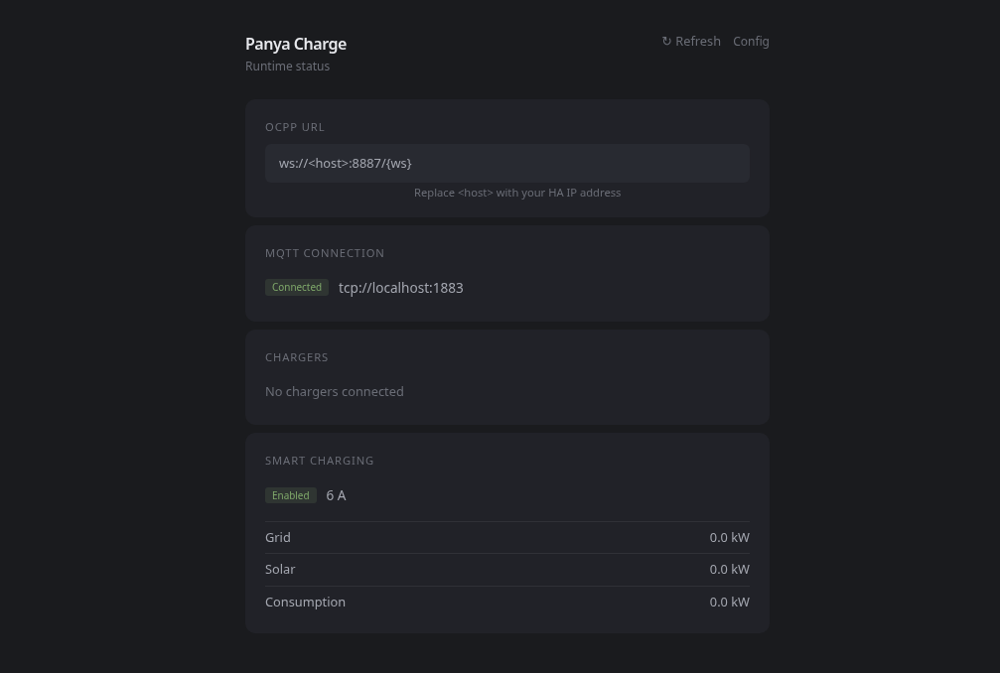

# panya-charge-oss

[](LICENSE)
[](https://go.dev)
[](https://openchargealliance.org/)

> ⚠️ **Alpha — simulator-validated only.** This CSMS has been tested against an
> OCPP 1.6-J simulator. Real hardware validation (ABB Terra AC) is in progress.
> Use at your own risk. See [Target Hardware](docs/hardware/abb-terra-ac.md)
> for details.

Open-source OCPP 1.6-J protocol bridge for EV chargers. Connects any OCPP 1.6-J compatible charger to Home Assistant via MQTT, enabling smart charging with solar surplus optimization.

## What It Does

- **OCPP 1.6-J CSMS** — WebSocket server for EV charger connectivity
- **MQTT Bridge** — Publishes charger status, power, and energy to MQTT topics
- **Home Assistant** — Auto-discovers charger entities via MQTT Discovery
- **Smart Charging** — Adjusts charging current based on solar surplus readings from grid power MQTT topics
- **Safety** — 180s contactor cooldown, 6A fallback on MQTT disconnect

## Architecture

Pure protocol bridge: OCPP ↔ MQTT ↔ Home Assistant. No database, no auth —
optional embedded config WebUI (disabled by default).

Two deployment modes:

- **Home Assistant Add-on** — one-click install from the HA Add-on Store. The
  add-on configures MQTT credentials automatically from HA's Services API.
- **Standalone** — run as a Go binary or Docker container on any host. Full
  control over all configuration options.

## Quick Start

### Home Assistant Add-on (Recommended)

The fastest path is the **Panya Charge OSS** add-on. Install from the Home
Assistant Add-on Store in one click — no building, no Docker, no config
files.

1. Go to **Settings → Add-ons → Add-on Store → ⋮ → Repositories**
2. Add: `https://github.com/chiabcc/panya-charge-oss`
3. Click **Panya Charge OSS** → **Install**
4. Configure MQTT topics and charging parameters in the add-on UI
5. Set your charger's OCPP URL to `ws://<HA-IP>:8887/{ws}`

See **[Install as a Home Assistant Add-on](docs/add-on-install.md)** for
full details, configuration reference, and troubleshooting.

### Alternative: Standalone Docker

Build and run the CSMS directly (standalone or inside Docker):

```bash
docker build -t panya-charge-oss .
docker run -p 8887:8887 -p 8888:8888 \
  -v $(pwd)/config.yaml:/app/config.yaml \
  panya-charge-oss
```

Or run from source:

```bash
git clone https://github.com/chiabcc/panya-charge-oss.git
cd panya-charge-oss
go run ./cmd/panya-charge-oss
```

The CSMS listens on port 8887 for OCPP WebSocket connections.
Point your charger to `ws://localhost:8887/{ws}`.

### Configuration

Create `config.yaml` (all values have defaults — file is optional):

```yaml
server:
  ocpp_port: 8887
  ocpp_path: /{ws}
  log_level: info
mqtt:
  broker: tcp://localhost:1883
  base_topic: panya
  topics:
    grid_power: "grid/power"
charging:
  min_amps: 6
  max_amps: 32
```

Override any value via environment variables (`PANYA_<SECTION>_<KEY>`):

```bash
PANYA_MQTT_BROKER=tcp://broker.local:1883 go run ./cmd/panya-charge-oss
```

## Config WebUI & Status Page

The embedded WebUI has two modes, controlled independently:

### Status Page (read-only, on by default)

Shows runtime information — OCPP URL, MQTT connection state, connected chargers, and smart charging readings. Auto-refreshes every 10 seconds. No authentication required.



Enabled by default on port 8888. Access at `http://localhost:8888/status`.

In HA add-on mode, the status page is served via HA ingress — click **Open Web UI** on the add-on page.

### Config Editor (read-write, off by default)

Lets you edit `config.yaml` from a browser, with consequence-aware badges showing whether each change applies instantly, briefly disconnects the charger, or requires a restart.


Enable in `config.yaml`:

```yaml
webui:
  enabled: true            # config editor (off by default)
  status_enabled: true     # status page (on by default)
  listen: "127.0.0.1:8888"
  token: "your-secret-token-here"
```

Access at the configured address. For LAN access, a token is required.

> **Note:** The config editor is **not available** in HA add-on mode (only the read-only status page is served via ingress). Use the add-on's Configuration tab to edit settings.

See the **[Config WebUI guide](docs/webui.md)** for API access, security details, and Docker instructions.

For library usage (embed the CSMS in your application), see
[docs/development.md](docs/development.md).

**Running on Home Assistant?** Install the [Panya Charge OSS Add-on](docs/add-on-install.md) — one-click install from the HA Add-on Store.

**Integrating with Home Assistant?** See the
[Home Assistant Integration Guide](docs/home-assistant.md).

## License

Apache 2.0 — see [LICENSE](LICENSE)