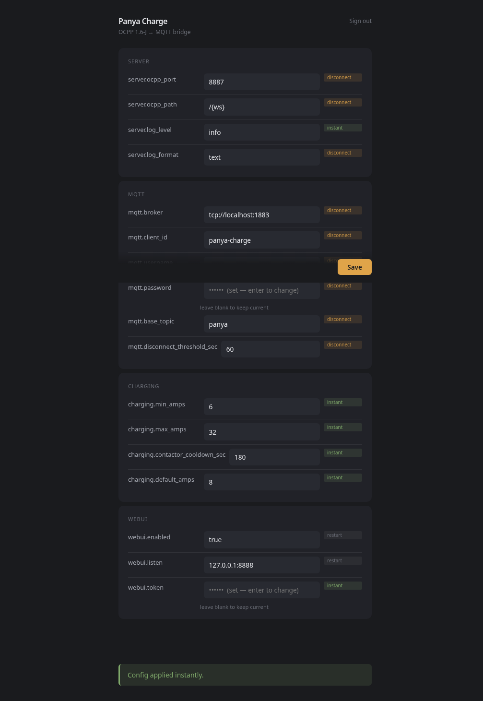

# panya-charge-oss

[](LICENSE)
[](https://go.dev)
[](https://openchargealliance.org/)

> ⚠️ **Alpha — simulator-validated only.** This CSMS has been tested against an
> OCPP 1.6-J simulator. Real hardware validation (ABB Terra AC) is in progress.
> Use at your own risk. See [Target Hardware](docs/hardware/abb-terra-ac.md)
> for details.

Open-source OCPP 1.6-J protocol bridge for EV chargers. Connects any OCPP 1.6-J compatible charger to Home Assistant via MQTT, enabling smart charging with solar surplus optimization.

## What It Does

- **OCPP 1.6-J CSMS** — WebSocket server for EV charger connectivity
- **MQTT Bridge** — Publishes charger status, power, and energy to MQTT topics
- **Home Assistant** — Auto-discovers charger entities via MQTT Discovery
- **Smart Charging** — Adjusts charging current based on solar surplus readings from grid power MQTT topics
- **Safety** — 180s contactor cooldown, 6A fallback on MQTT disconnect

## Architecture

Pure protocol bridge: OCPP ↔ MQTT ↔ Home Assistant. No database, no auth — optional embedded config WebUI (disabled by default).

## Quick Start

```bash
git clone https://github.com/chiabcc/panya-charge-oss.git
cd panya-charge-oss
go run ./cmd/panya-charge-oss
```

The CSMS listens on port 8887 for OCPP WebSocket connections.
Point your charger to `ws://localhost:8887/{ws}`.

### Configuration

Create `config.yaml` (all values have defaults — file is optional):

```yaml
server:
  ocpp_port: 8887
  ocpp_path: /{ws}
  log_level: info
mqtt:
  broker: tcp://localhost:1883
  base_topic: panya
charging:
  min_amps: 6
  max_amps: 32
```

Override any value via environment variables (`PANYA_<SECTION>_<KEY>`):

```bash
PANYA_MQTT_BROKER=tcp://broker.local:1883 go run ./cmd/panya-charge-oss
```

## Config WebUI

An optional embedded WebUI lets you edit `config.yaml` from a browser, with
consequence-aware badges showing whether each change applies instantly,
briefly disconnects the charger, or requires a restart.



Enable in `config.yaml` (off by default):

```yaml
webui:
  enabled: true
  listen: "127.0.0.1:8888"
  token: "your-secret-token-here"
```

Access at the configured address. For LAN access, a token is required.

See the **[Config WebUI guide](docs/webui.md)** for API access, security
details, and how field changes apply.

For library usage (embed the CSMS in your application), see
[docs/development.md](docs/development.md).

**Integrating with Home Assistant?** See the
[Home Assistant Integration Guide](docs/home-assistant.md).

## License

Apache 2.0 — see [LICENSE](LICENSE)