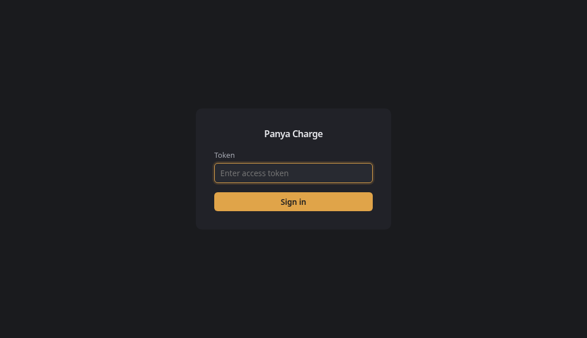

# Config WebUI

The embedded WebUI lets you edit `config.yaml` from a browser and applies changes with minimal disruption — hot-reloading what can be hot-reloaded, and warning before changes that require a charger reconnect or process restart.

Disabled by default. No database, no accounts — just a token.


## Enable

Add to `config.yaml`:

```yaml
webui:
  enabled: true
  listen: "127.0.0.1:8888"
  token: "a-strong-secret-token"
```

Then access at `http://127.0.0.1:8888`.

### LAN access

To bind on a non-loopback address (e.g., `0.0.0.0:8888` for access from other machines on your network), a token is **required** — the server will refuse to start without one. This prevents running an unauthenticated config endpoint on your LAN.

```yaml
webui:
  enabled: true
  listen: "0.0.0.0:8888"
  token: "a-long-random-string-here"
```

### Environment overrides

All WebUI settings can be set via environment variables instead of YAML:

```bash
PANYA_WEBUI_ENABLED=true
PANYA_WEBUI_LISTEN=127.0.0.1:8888
PANYA_WEBUI_TOKEN=your-secret
```

When a config field is overridden by an environment variable, it appears **disabled** in the UI with an `ENV` badge — you must change the environment variable, not the form.

## Login



Enter the token you configured. The session lasts 24 hours via an `HttpOnly` + `SameSite=Strict` cookie. On loopback without a token set, the config page is served directly (no login).

## How changes apply

Every field shows a badge indicating what happens when you change it:

| Badge | Meaning | Examples |
|---|---|---|
| **instant** | Applied immediately without charger disruption | `min_amps`, `max_amps`, `log_level` |
| **disconnect** | Charger briefly disconnects (~5s) while the bridge rebuilds | `mqtt.broker`, `ocpp_port`, `base_topic` |
| **restart** | Saved to disk — takes effect on next process restart | `webui.enabled`, `webui.listen` |

When a change requires a rebuild and a charging session is active, the UI shows a confirmation prompt listing the affected fields before proceeding.

### Secrets

`mqtt.password` and `webui.token` are **write-only** — they never appear in HTTP responses. The form shows a password field with a placeholder; leave it blank to keep the current value.

## Status Page

A read-only status page shows runtime information: OCPP URL for your charger, MQTT connection state, connected chargers, and smart charging readings. No authentication required — designed for HA ingress or loopback access.


### Enable

The status page is **enabled by default**. It runs on the same port as the config WebUI (`8888`), independent of `webui.enabled`:

```yaml
webui:
  enabled: false           # config editor (off by default)
  status_enabled: true     # status page (on by default)
  listen: "127.0.0.1:8888"
```

Access at `http://127.0.0.1:8888/status`.

### What it shows

| Section | Data |
|---|---|
| **OCPP URL** | WebSocket URL for charger configuration: `ws://<host>:8887/{ws}` |
| **MQTT Connection** | Connected/disconnected badge + broker address |
| **Chargers** | Table: ID, vendor/model, status (Available/Charging/Faulted), connector, power, current limit |
| **Smart Charging** | Enabled/disabled, safe amps fallback, grid/solar/consumption power readings |

The page auto-refreshes every 10 seconds.

### JSON API

```bash
curl http://127.0.0.1:8888/api/status
```

```json
{
  "mqtt": { "connected": true, "broker": "tcp://localhost:1883" },
  "chargers": [],
  "charging": { "current_amps": 6, "enabled": true, "grid_w": 0, "solar_w": 0, "consumption_w": 0 },
  "ocpp": { "port": 8887, "path": "/{ws}" }
}
```

### Home Assistant ingress

In HA add-on mode, the status page is served via HA ingress. Click "Open Web UI" on the add-on page in HA. The config editor stays disabled — all configuration is done through HA's schema form.

## Docker

### Expose the Web UI

The root `Dockerfile` exposes port `8887` (OCPP). To access the Web UI or status page, also publish port `8888`:

```bash
docker build -t panya-charge-oss .

docker run -p 8887:8887 -p 8888:8888 \
  -v $(pwd)/config.yaml:/data/config.yaml \
  panya-charge-oss
```

Then access:
- **Status page**: `http://localhost:8888/status`
- **Config editor** (if `webui.enabled: true`): `http://localhost:8888`

### Status page only

To run with just the status page (no config editor), set env vars:

```bash
docker run -p 8887:8887 -p 8888:8888 \
  -e PANYA_WEBUI_ENABLED=false \
  -e PANYA_WEBUI_STATUS_ENABLED=true \
  -e PANYA_MQTT_BROKER=tcp://host.docker.internal:1883 \
  panya-charge-oss -config ""
```

> **Note**: Inside Docker, use `host.docker.internal` (or the host's IP) to reach an MQTT broker running on the host. `localhost` inside the container refers to the container itself.

### Full config editor + status page

```bash
docker run -p 8887:8887 -p 8888:8888 \
  -e PANYA_WEBUI_ENABLED=true \
  -e PANYA_WEBUI_LISTEN=0.0.0.0:8888 \
  -e PANYA_WEBUI_TOKEN=your-secret-token \
  -e PANYA_MQTT_BROKER=tcp://host.docker.internal:1883 \
  panya-charge-oss -config ""
```

Access config editor at `http://localhost:8888`, enter token to log in. Status page at `http://localhost:8888/status` is always accessible without auth.

## Architecture

- **Go `html/template`** + vendored [htmx](https://htmx.org) for partial swaps
- **stdlib `net/http`** only — no framework, no frontend build step
- Templates and static assets are embedded via `embed.FS` (single binary)
- Content negotiation: `Accept: text/html` renders the form, `Accept: application/json` returns the config as JSON for programmatic access

### API

| Method | Path | Purpose |
|---|---|---|
| `GET` | `/status` | Status page (HTML, read-only) |
| `GET` | `/api/status` | Runtime status (JSON) |
| `GET` | `/api/config` | Effective config (HTML form or JSON via Accept header) |
| `POST` | `/api/config` | Save config (htmx partial or JSON response) |
| `POST` | `/login` | Authenticate with token |
| `POST` | `/logout` | Clear session |

```bash
# Read config as JSON
curl -H "Accept: application/json" -b "panya_webui_session=<token>" \
  http://127.0.0.1:8888/api/config
```

## Design

The interface follows a **Graphite & Amber** design system rooted in the charger's physical world — brushed-aluminium surfaces, a single amber accent (the charging LED color), and elevation-based depth instead of decorative borders. See [`.interface-design/system.md`](../.interface-design/system.md) for the full token system.
